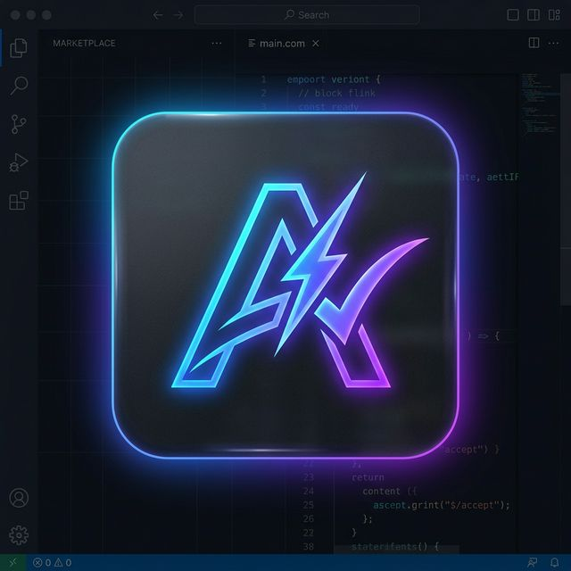
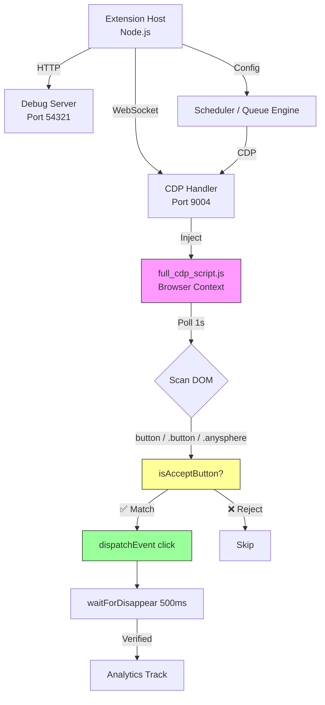

<p align="center">
  
</p>

<h1 align="center">⚡ Antigravity Auto Accept</h1>

<p align="center">
  <strong>Zero-click automation for Antigravity IDE — Accept file edits, terminal commands & recovery prompts automatically.</strong>
</p>

<p align="center">
  <a href="LICENSE.md"></a>
  
  
  
</p>

<p align="center">
  <a href="#-quick-start">Quick Start</a> •
  <a href="#-features">Features</a> •
  <a href="#-architecture">Architecture</a> •
  <a href="#-configuration">Configuration</a> •
  <a href="#-credits">Credits</a>
</p>

---

## 🤔 The Problem

Antigravity's multi-agent workflow is **incredibly powerful**, but it stops **every single time** an agent needs approval — file edits, terminal commands, retry prompts.

> **That's dozens of interruptions per hour.** You're essentially babysitting an AI.

## 💡 The Solution

**Antigravity Auto Accept** eliminates the wait. It runs silently in the background, auto-clicking approval buttons so you can focus on what matters — building.

| What it handles | How |
|---|---|
| ✅ File edits | Auto-accepted |
| ✅ Terminal commands | Auto-executed |
| ✅ Retry prompts | Auto-confirmed |
| ✅ Stuck agents | Auto-recovered |
| 🛡️ Dangerous commands | **Blocked** (`rm -rf`, `format c:`, etc.) |

---

## 🚀 Quick Start

```bash
# 1. Install the VSIX
# Download from Releases → Install via Extensions sidebar → "Install from VSIX..."

# 2. Relaunch Antigravity (one-time, adds --remote-debugging-port=9004)
# The extension will prompt you automatically

# 3. Done! Check status bar for "Antigravity: ON" ✅
```

> **That's it.** No config files, no API keys, no setup wizard. Just install and go.

---

## ✨ Features

### 🎯 Smart Auto-Accept
- Detects and clicks `Accept`, `Run`, `Retry`, `Apply`, `Confirm`, `Allow` buttons
- **Typing protection** — pauses auto-clicking when you're actively typing (4-second buffer)
- **Visibility checks** — only clicks visible, enabled, non-hidden buttons
- Polls every 1 second (configurable)

### 📋 Prompt Queue Engine
Automate entire workflows with sequenced prompts:
- **Queue Mode** — Run tasks sequentially with silence detection
- **Interval Mode** — Send prompts on a timer
- **Check Prompts** — Verify task completion before advancing
- **CDP injection** — Sends messages directly into Antigravity's chat panel

### 📊 Antigravity Quota Monitor
Real-time credit tracking in the status bar:
- Remaining credits & usage percentage
- Time until quota reset
- Auto-pause/resume when quota is exhausted

### 🛡️ Safety & Dangerous Command Blocking
Built-in protection against destructive commands:
```
rm -rf /    rm -rf ~    format c:    del /f /s /q
dd if=      mkfs.       :(){:|:&};:  > /dev/sda
```
Fully customizable blocklist with regex pattern support.

### 📈 Impact Dashboard
Track your productivity gains:
- Clicks saved per session/week
- Estimated time recovered
- Terminal commands vs file edits breakdown
- Away-from-desk action tracking

### 🔧 Remote Debug Server
HTTP API on port `54321` for programmatic control:
- Full state inspection & configuration
- Queue control (start/pause/resume/skip/stop)
- Browser-side JavaScript evaluation via CDP
- Settings Panel UI automation

---

## 🏗️ Architecture



### Key Design Decisions
- **CDP over VS Code API** — Antigravity's chat is a webview, not accessible via standard extension APIs
- **Narrow DOM selectors** — Only scans `button`, `[class*="button"]`, `[class*="anysphere"]` to avoid false positives
- **Session singleton** — Poll loop uses incrementing `sessionID` to prevent duplicate loops
- **Keystroke guard** — Tracks `keydown` events globally to avoid interrupting user input

---

## ⚙️ Configuration

| Setting | Default | Description |
|---|---|---|
| `auto-accept.cdpPort` | `9004` | CDP debugging port |
| `auto-accept.schedule.enabled` | `false` | Enable prompt scheduler |
| `auto-accept.schedule.mode` | `queue` | `queue` or `interval` |
| `auto-accept.schedule.silenceTimeout` | `30` | Seconds of silence before advancing queue |
| `auto-accept.debugMode.enabled` | `false` | Enable HTTP debug server on port 54321 |
| `auto-accept.antigravityQuota.enabled` | `true` | Monitor Antigravity quota |

---

## 📁 Project Structure

```
├── extension.js              # Entry point
├── main_scripts/
│   ├── extension-impl.js     # Core extension lifecycle
│   ├── full_cdp_script.js    # Browser-injected auto-accept logic
│   ├── cdp-handler.js        # WebSocket CDP connection manager
│   ├── debug-handler.js      # HTTP debug server (port 54321)
│   ├── settings-panel.js     # WebView settings UI
│   └── relauncher.js         # One-click relaunch with CDP flag
├── media/
│   └── icon.png              # Extension icon
├── docs/
│   ├── WORKFLOW.md           # Development workflows
│   └── DEBUG_TESTING.md      # Debug & testing guide
└── tests/
    └── scheduler.test.js     # Queue engine tests
```

---

## 🔧 Requirements

- **Antigravity IDE** (or any Electron-based code editor with CDP support)
- Launched with `--remote-debugging-port=9004`
- The extension handles relaunch automatically on first install

---

## 🙏 Credits & Thanks

Built upon excellent work from the community:

- [Auto Accept Agent](https://github.com/Munkhin/auto-accept-agent) by Munkhin — Original auto-accept concept
- [Antigravity Quota Watcher](https://github.com/Henrik-3/AntigravityQuota) by Henrik-3 — Quota monitoring
- [Rodhayl Multi Purpose Agent](https://github.com/rodhayl/antigravity-multi-purpose-agent) by Rodhayl — Stable CDP architecture foundation (v1.0.1)

---

## 📄 License

[MIT](LICENSE.md) — Use it, fork it, ship it. No strings attached.

---

<p align="center">
  <strong>⭐ Star this repo if it saves you time! Every star helps others discover this tool.</strong>
</p>

<p align="center">
  Made with ⚡ by <a href="https://github.com/hungpixi">hungpixi</a> / <a href="https://comarai.com">comarai.com</a>
</p>
